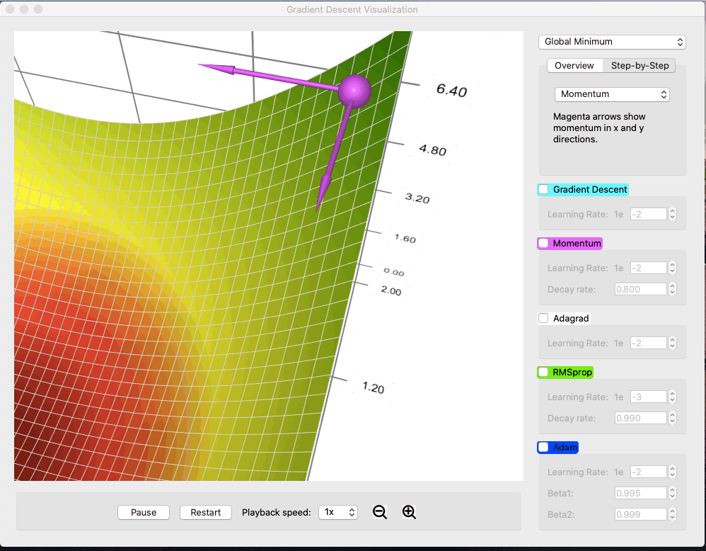
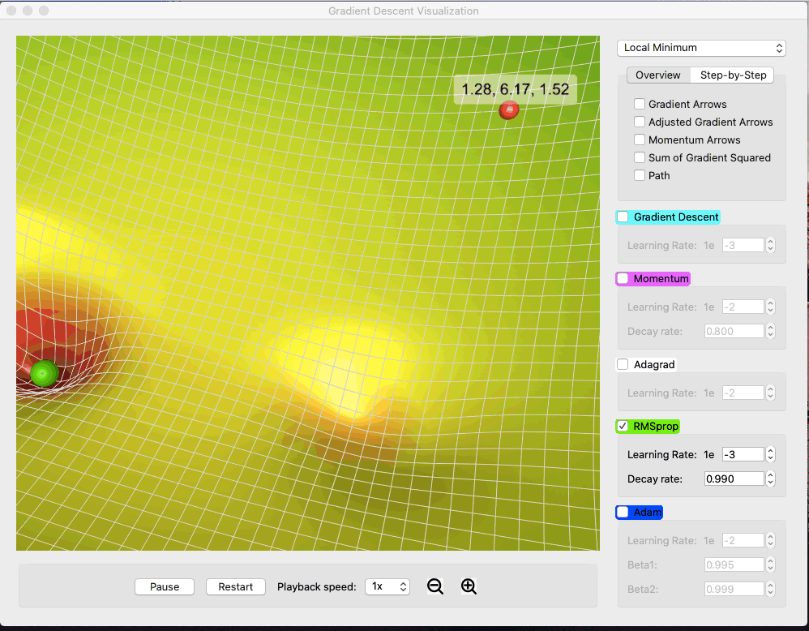
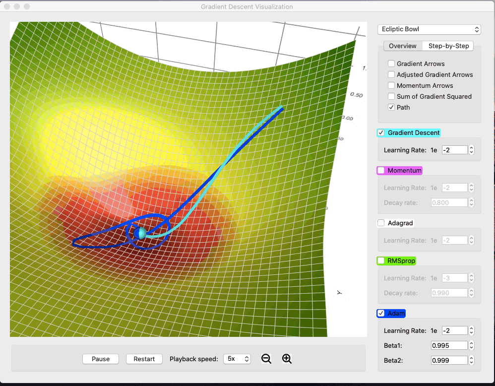
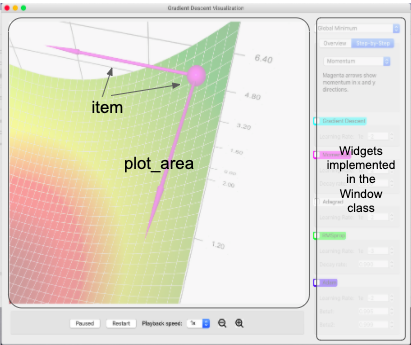

# gradient_descent_viz

Gradient Descent Viz is a desktop app that visualizes some popular [gradient descent methods](https://en.wikipedia.org/wiki/Stochastic_gradient_descent)
in machine learning. By playing around the different settings
oneself, everyone -- beginners or experts -- hopefully can take away some new intuitive understanding of these methods.

## Features
* Choose between a few different surfaces. For example, in the screen recording
below, you can see that Adam and RMSProp handle saddle points much better than simple gradient descent or momentum.

* Tune parameters. The demo shows a surface with a plateau (right click and drag to rotate, arrow keys to navigate, and ctrl (or cmd) + plus / minus
to zoom). Momentum method with a low learning rate is not enough to propel it through the flat region. Dialing up the learning rate
solves the issue. Play around with the other parameters too and see what you find. 

* Watch step-by-step cartoon to visualize the calculation process of each method. Below is a demo of inner workings of momentum descent.

* Use visual elements to track things such as the gradient, the momentum, sum of squared gradient (visualized by squares whose size
corresponds to the magnitude of the term), adjusted gradient (after dividing by the sum of squared gradient or adding on momentum, depending
on the method), and the path. In the example below, you can see that after adjusted by the sum of squared gradient, RMSProp
takes a very different direction. Comparing that with AdaGrad, one will visually see that the sum of squared gradient for AdaGrad 
is much bigger in scale (because it doesn't decay). You can use this feature to understand what makes each method work or not work under different circumstances.

* Draw path of the descents. See how different methods reach the destination in different manners.

## Building
This is a C++ app written in Qt, using the free Qt open-source licensed version. 
To build, download and install Qt 5.10 or above (https://www.qt.io/download) for your platform. This app uses the Qt Data Visualization package; make sure
to include that in your installation as well.
Checkout this repository, and build and run gradient_descent_visualization.pro within the Qt Creator IDE.

## Code Structure

* The window class is responsible for the UI layout, including all the widgets (spinbox, input text box, etc) on the side bar.
* The plot_area class is responsible for actions happen inside the plot region, including methods that respond to user inputs
using the widgets (e.g. play / pause, change playback speed, change surface, etc). 
* The animation class controls the logic for animation. Each descent method has its own derived animation class, which owns the
animated ball, arrows, etc. The class controls the creation and destruction of these objects as well as their placement and properties (such as
magnitude and color).
* The item class and its derived classes inherit QtCustom3DItem and are implementations of our customed items such as the arrows, the
squares, the path (which is really just a 3D surface), etc.
* The GradientDescent class and its derived classes are the mathematic implementations of each descent method. 

